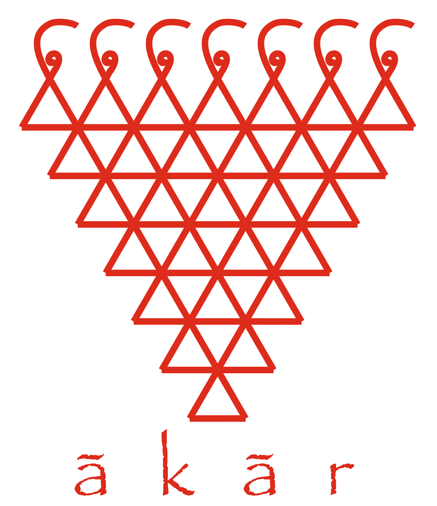

# Akar

Akar is a 1st class patterns library for Clojure.

This is very much a work in progress, and is not ready for use yet. Star/Watch for updates.

This effort draws a heavy inspiration from Brent Yorgey's Haskell library [`Data.Pattern`](https://hackage.haskell.org/package/first-class-patterns-0.3.2/docs/Data-Pattern.html).

## License

Copyright © 2015 Rahul Goma Phulore

Distributed under the Eclipse Public License, the same as Clojure.
