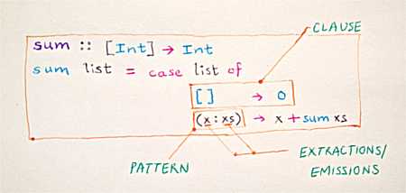

# Akar Tutorial

## Background

### Pattern matching

Pattern matching is a standard feature found in many programming languages, such as Haskell, Scala, Erlang, and the ML family. There also exist implementations for [Newspeak](http://gbracha.blogspot.de/2010/06/patterns-as-objects-in-newspeak.html), [Common Lisp](https://github.com/m2ym/optima), [Racket](http://docs.racket-lang.org/reference/match.html), and [Clojure](https://github.com/clojure/core.match).

Pattern matching allows you to decompose data, inspect it for desired structure or properties, and if affirmative, extract the relevant pieces. Patterns can also be arbitrarily nested, allowing for deep data deconstruction. You could think of pattern matching as `if`/`switch` on steroids.

Let's consider a very simple example from Phil Wadler's [critique of SICP](http://www.cs.kent.ac.uk/people/staff/dat/miranda/wadler87.pdf).

Here's how you sum a list of numbers in [Miranda](https://en.wikipedia.org/wiki/Miranda_programming_language) (or Haskell; same syntax here):

```haskell
sum []     = 0
sum (x:xs) = x + sum xs
```

There are two clauses in this definition: one for an empty list (base case), and another for cons. `[]` is the Miranda notation for an empty list, and `(x:xs)` is a notation for a cons list with head `x` and tail `xs`.

Compare this with an equivalent Scheme definition:

```scheme
(define (sum a-list)
  (if (null? a-list)
    0
    (+ (car a-list) (sum (cdr a-list))))) 
```

As the author points out, the Scheme version is less readable than the Miranda one for following reasons:

0. The symmetry between the two cases is obscured. The empty case is tested for explicitly, and the cons case is assumed otherwise.
0. The extraction happens independently of the tests, even though there's a clear dependency of the former on the latter. 

To quote the author further:   

> A good choice of notation can greatly aid learning and thought, and a poor choice can hinder it. In particular, pattern-matching seems to aid thought about **case analysis**, making it easier to construct programs and to prove their properties by **structural induction**.

In their report ["Pattern Matching for an Object-oriented and Dynamically Typed Programming Language"](https://publishup.uni-potsdam.de/files/4204/tbhpi36.pdf), Geller et al also echo a similar sentiment:

> In contrast to regular accessors and conditional statements, it can be argued that deep pattern matching allows concise, readable deconstruction of complex data structures. More specifically, multiple nested conditional expressions quickly become difficult to read, while nested patterns allow destructuring of nested data containers in a single expression.

### Traditional implementations

Traditionally, pattern matches are compiled to [highly efficient matching automata](http://pauillac.inria.fr/~maranget/papers/ml05e-maranget.pdf), typically decision trees, realized using low level  tests, jump tables, and so on. This efficiency however comes at a cost.

The first section of Mark Tullsen's ["First Class Patterns"](http://citeseerx.ist.psu.edu/viewdoc/download;jsessionid=7D0C1723046D2DCD47099E7B2557381C?doi=10.1.1.37.7006&rep=rep1&type=pdf) paper enumerates a number of drawbacks associated with traditional implementations. Here is a brief summary:

0. **Patterns are too complex.** Pattern matching usually comes with dozens of special purpose features, each of which occupies a place of its own in compilers and language specifications. (Currently ten pages in the Haskell 98 Report are dediated to pattern mathing.) This makes them both harder to implement and use.
0. **Patterns have inelegant semantics.** Patterns impose a left-to-right, top-to-bottom evaluation order. If we want a different evaluation order, we must either do without patterns or write far less elegant looking ode.
0. **You cannot abstract over patterns.** Patterns being a syntactic construct makes it almost impossible to abstract over them. This limits expressivity greatly. Languages end up adding more syntactic extensions, such as [view patterns](https://ghc.haskell.org/trac/ghc/wiki/ViewPatterns) and [pattern synonyms](https://ghc.haskell.org/trac/ghc/wiki/PatternSynonyms) to support any abstraction, complicating the implementation and semantics even further.

Tullsen ascribes most of these deficiencies to patterns not being first class values. In Gilad Bracha's words, they are a [shadow language](http://gbracha.blogspot.de/2014/09/a-domain-of-shadows.html).

Akar patterns are first class values, and alleviate all of the problems described here. This also means that we do not compile down to efficient decision trees, as is the case with traditional implementations. As stated earlier, Akar focuses on simplicity and abstraction, and as such, trades off some performance for it. [TANSTAAFL](https://en.wikipedia.org/wiki/There_ain%27t_no_such_thing_as_a_free_lunch)! You can read more about performance in the FAQs.


### First class patterns

We will start with some terminology. Look at the diagram below:



This is the same example as before, with a slightly different syntax.

We refer to the structure or property we are matching against as **pattern**.

Each case of pattern match, along with the code to be excuted on a successful match, is referred to as a **clause**.

On some successful pattern matches, we can extract parts of the structure, and bind them to fresh variables scoped under the clause the pattern is a part of. We refer to these as **extractions**. The term "extract" carries an implication that these values are constituents of the original structure, which is something we cannot guarantee when patterns are arbitrary functions. So we sometimes also use a more unassuming term **emissions** to refer to these values.

Let's now put on our "functional goggles" for a bit, and try to see these constructs as functions.


A **pattern** is something that **matches** the data against some structure or properties, and can potentially **emit** some values in case of a match. The following signature captures this contract precisely:
 
```
data -> (emissions | nil)
```

`emissions` is a sequence of emitted values. 

`nil` would mean that the match failed.

A **clause** is a function that combines a **pattern** and a **function** to be invoked on a successful match.

```
((data -> emissions | nil), (emissions -> result)) -> (data -> result | nil)
```

These are the formulations used by Akar. There's literally nothing more to it! Amazed yet?

Treating patterns as regular functions opens up new possibilities. You can abstract over and compose them, like you do with any other functions. It's much simpler do build new features. In fact, this is exactly how various pattern operations, such as guards, at-patterns, alternation, are implemented in Akar. That should serve as a testament to the simplicity and power of this model.

This is not a novel idea, and there is quite a bit of "prior art" out there:

0. [first-class-patterns](http://hackage.haskell.org/package/first-class-patterns), a Haskell library by Brent Yorgey. (Akar borrows many ideas from this library.) 
0. [Newspeak](http://gbracha.blogspot.de/2010/06/patterns-as-objects-in-newspeak.html) [patterns](https://publishup.uni-potsdam.de/files/4204/tbhpi36.pdf).
0. John De Goes' [presentation](http://www.slideshare.net/jdegoes/firstclass-patterns), where he also links to a Javascript fiddle illustrating the ideas.
0. ["First Class Patterns"](www.cs.yale.edu/~tullsen/patterns.ps), a paper by Mark Tullsen. (Previously referred in this article.)
0. [Active patterns](http://fsharpforfunandprofit.com/posts/convenience-active-patterns/) in F#.
0. Scala [extractors](http://lampwww.epfl.ch/~emir/written/MatchingObjectsWithPatterns-TR.pdf). (Sort of, but not quite).

*(This tutorial borrows many explanations and examples from the above mentioned resources.)*

## Diving in

Without further ado, let's dive right in! 

Start a Clojure REPL with Akar on path. The easiest way to do so might be to clone this project, and firing `lein repl` from inside the directory. Alternatively, you could use [`lein-try`](https://github.com/rkneufeld/lein-try). 

You should find yourself in the `akar.try-out` namespace by default. If not, switch to it manually. This namespace brings in all the modules that we will be needing for this tutorial.

This tutorial is structured in a bottom up fashion. We introduce you to the underlying primitives, pattern functions, and combinators first. The discussion on syntax is deferred for later.

### Pattern functions

#### 'Ignore' patterns

Let's start defining some patterns.

All pattern matching implementations feature a way to **ignore** the value being matched. The typical syntax is `_`. Consider the following Haskell example:
 
```haskell
case n of
     2 -> True       -- Give True if n == 2
     _ -> False      -- Otherwise give False
```

How will you formulate the "ignore" pattern as a function? Easy! It should always return an empty sequence (i.e. no emissions) regardless of its input. 

Akar ships with such a function, and it's called `!any`. Inspect its source in your REPL.

```clojure
user=> (source !any)
(def !any
  (fn [_]
    []))
nil
```

(If you are going "Hmm, what are those bangs?" at this point, the FAQs might help you out.)

Test it out!

```clojure
user=> (!any 2)
[]

user=> (!any :banana)
[]
```

Sweet!

#### Bindings

Let's define another common pattern matching feature: **Binding**. In patterns, you can bind the values being matched to fresh variables, which will be available in scope of the clause they are a part of.

This happens in two parts. First, we must define a function that emits its arguments as-is, indiscriminately. Akar defines such a function for you. It's called `!bind`.
 
```clojure
user=> (source !bind)
(def !bind
  (fn [arg]
    [arg]))
nil

user=> (!bind 2)
[2]

user=> (!bind :banana)
[:banana]
```

Thie second part is about consuming the emitted values. This is where the function `clause*` comes in picture.

Let's see this in action.

```clojure
user=> (def c (clause* !any (fn [] :hey)))
#'user/c

user=> (c 2)
:hey

user=> (c :banana)
:hey

user=> (def c2 (clause* !bind (fn [x] [:result x])))
#'user/c2

user=> (c2 2)
[:result 2]

user=> (c2 :banana)
[:result :banana]
``` 

If the number of values emitted by a pattern do not match the number of arguments accepted by the action, there will be an error.

```clojure
user=> (def c3 (clause* !any (fn [x] [:result x])))
#'user/c3

user=> (c3 2)
ArityException Wrong number of args (0) passed to: user/fn--2607  clojure.lang.AFn.throwArity (AFn.java:429)
```

#### Constant patterns

Moving on, let's define a pattern that matches specifically for value `1`.
 
```clojure
user=> (def !one
  #_=>   (fn [arg] (if (= arg 1) [])))
#'user/!one

user=> (!one 1)
[]

user=> (!one 2)
nil
```

That works. But it would suck to be maddening to have to define a new pattern for every new constant we want to test for. How could we generalize this further to work with any **constants**? Easy! Parametrize it.
 
```clojure
user=> (defn !cst [x]
  #_=>   (fn [arg] (if (= arg x) [])))
#'user/!cst

user=> ((!cst :woop) :woop)
[]

user=> ((!cst :woop) :not-so-woop)
nil
```

Akar already has this function, and it's called `!constant`.

#### Predicate patterns

We could generalize this even further to accept any **predicate**, and not be restricted to just equality tests. Sure enough, Akar has this covered as well.

```clojure
user=> (source !pred)
(defn !pred [pred]
  (fn [x]
    (if (pred x)
      [])))
nil

user=> ((!pred odd?) 3)
[]

user=> ((!pred odd?) 2)
nil
```
 
I hope this gives you an idea of how pattern functions work. I suggest you skim through [patterns.clj](src/akar/patterns.clj) before continuing further.

...

Hi, good to see you again!

Now that we have seen a bunch of pattern functions, let's try and put it all together in a pattern matching block.

You can compose clauses with a function named `or-else`. There's a utility function named `clauses*` which allows you define a group of clauses with slightly less noise. 

The function `match*` allows you to match a value against a bunch of clauses. 
    
Here is a full example.

```clojure
user=> (defn foo [n]
  #_=>   (match* n (clauses* (!constant 4) (fn [] :four)
  #_=>                       (!pred even?) (fn [] :even)
  #_=>                       !bind         (fn [x] x)
  #_=>                       !any          (fn [] :we-will-never-get-here))))
#'user/foo

user=> (foo 4)
:four

user=> (foo 2)
:even

user=> (foo 3)
3
```

### Nested patterns 

We mentioned in passing that pattern matching allows for deep deconstruction. Consider the following Haskell example to understand what we mean:
 
```haskell
foo xs = case xs of
              2:_ -> "starts with 2"
              x:_ -> "starts with " ++ show x
              _   -> "empty"
```

In the first clause, not only do we split up the list into its head and tail, but also further match that the head is equal to `2`. In the second clause, we bind the head to a value, but discard the tail. This is nested pattern matching. 
 
Akar has a pattern `!cons` that splits the head and tail of a list.

```clojure
user=> (!cons [2 3 4])
[2 (3 4)]
```

How do we further match on head and rest? 

Enter `!further`! 

`!further` is a combinator that takes a root pattern, and a sequence of further patterns, that will be applied with the values emitted by the root pattern, when it matches.

Let's see some examples.

```clojure
user=> ((!further !cons [(!constant 2) !bind]) [2 3 4])
((3 4))

user=> ((!further !cons [(!constant 2) !bind]) [5 3 4])
nil

user=> ((!further !cons [!bind !bind]) [5 3 4])
(5 (3 4))

user=> ((!further !cons [!any !any]) [5 3 4])
()
```

As you can see, all the bindings from the nested patterns are being correctly accumulated. 

The Haskell example we saw previously can be written with Akar as follows:

```clojure
user=> (defn foo [xs]
  #_=>   (match* xs (clauses* (!further !cons [(!constant 2) !any]) (fn [] "starts with 2")
  #_=>                        (!further !cons [!bind !any])         (fn [x] (str "starts with " x))
  #_=>                        !any                                  (fn [] "empty"))))
#'user/foo

user=> (foo [2 3 4])
"starts with 2"

user=> (foo [5 3 4])
"starts with 5"

user=> (foo [])
"empty"
```

### Pattern combinators

You can manipulate and combine patterns in a number of ways. 
 
- Negating a pattern.

```clojure
user=> ((!not (!constant 3)) 3)
nil

user=> ((!not (!constant 4)) 3)
[]
```

- Conjunction of multiple patterns.

```clojure
user=> ((!and (!key :name) (!key :age)) {:name "quentin" :age 25})
("quentin" 25)

user=> ((!and (!key :name) (!key :age)) {:name "quentin"})
nil
```

- Disjunction of multiple patterns. (Aka, alternation.)

```clojure
user=> ((!or (!constant 2) (!constant 3)) 2)
[]

user=> ((!or (!constant 2) (!constant 3)) 3)
[]

user=> ((!or (!constant 2) (!constant 3)) 4)
nil

user=> ((!or (!key :kr-number) (!key :tr-number)) {:kr-number "k 11" :tr-number "t 25"})
["k 11"]

user=> ((!or (!key :kr-number) (!key :tr-number)) {:tr-number "t 25"})
["t 25"]

```

- Applying a function to an argument, and then matching its result against a pattern. This is known in Haskell world as [view patterns](https://ghc.haskell.org/trac/ghc/wiki/ViewPatterns).

```clojure
user=> (def five-ish (!view #(Math/abs %) (!constant 5)))
#'user/five-ish

user=> (five-ish 5)
[]

user=> (five-ish -5)
[]

user=> (five-ish 6)
nil
```

- Guard a pattern with an additional predicate.

```
user=> ((!guard !cons vector?) [2 3])
(2 (3))

user=> ((!guard !cons vector?) '(2 3))
nil
```

- Apart from the emitted values, also bind the value being matched. These are called at-patterns or as-patterns.
 
```clojure
user=> ((!at (!constant 3)) 3)
(3)

user=> ((!at (!constant 3)) 4)
nil
```

Look up the definitions of `!view`, `!guard`, and `!at` in your REPL. Look how simple they are!

## Syntax

### Motivation

Let's consider a bigger, more realistic example to motivate this section.
 
```clojure
; We receive events from a remote Zookeeper cluster, and in response, we need to 
; update the local cache. On `:child-added` and `:child-updated` events, we must 
; put the entry in local cache. On `:child-removed` event, we must remove the 
; entry from local cache as well.

user=> (def cache (java.util.concurrent.ConcurrentHashMap.))
#'user/cache

user=> (defn act-on-event [evt]
  #_=>   (match* evt (clauses* (!and (!further (!key :evt-type) [(!or (!constant :child-added)
  #_=>                                                                (!constant :child-updated))])
  #_=>                               (!key :data)
  #_=>                               (!key :path)) (fn [data path] (.put cache path data))
  #_=>
  #_=>                         (!and (!further (!key :evt-type) [(!constant :child-removed)])
  #_=>                               (!key :path)) (fn [path] (.remove cache path))
  #_=>
  #_=>                         !any (fn [] nil))))
#'user/act-on-event

user=> (act-on-event {:evt-type :child-added :data "d" :path "p"})
nil

user=> cache
{"p" "d"}

user=> (act-on-event {:evt-type :child-updated :data "e" :path "q"})
nil

user=> cache
{"p" "d", "q" "e"}

user=> (act-on-event {:evt-type :child-updated :data "e" :path "r"})
nil

user=> cache
{"p" "d", "q" "e", "r" "e"}

user=> (act-on-event {:evt-type :child-removed :path "r"})
"e"

user=> cache
{"p" "d", "q" "e"}

user=> (act-on-event {:evt-type :child-transmogrified :path "r"})
nil

user=> cache
{"p" "d", "q" "e"}
```

Well... That escalated quickly!

As we marvel at the functional elegance of this piece, we can't help but notice that this is the kind of syntax only a mother would love. We could define helper pattern functions, but for such a simple logic, it would be nice not to have to do that.

The point I am trying to make is that [notation is a tool of thought](http://www.eecg.toronto.edu/~jzhu/csc326/readings/iverson.pdf), and therefore [syntax matters](http://tomasp.net/academic/papers/computation-zoo/talk-tfp.pdf).  

Akar acknowledges this, and features a syntactic layer that makes common use cases convenient, but at the same time stays true to the first-class spirit of the core model. 

### seqex

In ClojureConj 2013, [Jonathan Claggett](https://github.com/jclaggett) and [Chris Houser](https://github.com/Chouser) had a talk called ["Illuminated Projects"](https://www.youtube.com/watch?v=o75g9ZRoLaw), where they presented [seqex](https://github.com/jclaggett/seqex), a project they had been working on. (If you write Clojure (or, are simply enthusiastic about it), I cannot recommend you this talk enough. Queue it up!)  
 
seqex is pure brilliance. It allows you to define new syntax as a set of grammar rules. This makes it much simpler to create new syntax, gives you auto-generated documentation, and produces better error messages (by Clojure standards).
   
The syntax module in Akar was built using seqex.  

Run the following lines in your REPL, and marvel at the output. :smile: 
  
```clojure
(syndoc match)
(syndoc pattern')
```

`match` is a syntax/macro version of the function `match*`. We also have `clause`, `clauses`, and so on.

### akar.syntax

We will go over the important bits of syntax supported by Akar. We will use functions `syndoc`, `parse-forms` (also from seqex) and `macroexpand-1` to study these. You have already seen `syndoc`. The latter two will help us see how various syntactic patterns translate to corresponding functions. 
     
Syntactic patterns map to corresponding pattern functions, plus name bindings introduced by that pattern. 

Let's start with `any'` syntactic patterns.
  
```clojure
user=> (syndoc any')
  any' => :_ | :any
nil

user=> (parse-forms any' '(:_))
{:pattern akar.patterns/!any, :bindings []}

user=> (parse-forms any' '(:any))
{:pattern akar.patterns/!any, :bindings []}

user=> (parse-forms any' '(:wrong-keyword))
Bad value: :wrong-keyword
Expected any of:
    :_
    :any
nil
```

`any'` syntactic patterns map to `!any` function, and introduce no bindings.

Next let's look at `binding'` syntactic patterns.
  
```clojure
user=> (parse-forms binding' '(x))
{:pattern akar.patterns/!bind, :bindings [x]}
```

As can be seen, the symbol is being introduced as a binding. 

To see how this gets consumed, let's write a full `match` expressions.

```clojure
user=> (match 3
  #_=>        x (inc x))
4
```

It's educational to see what this expands to:

```clojure
user=> (pprint (macroexpand-1 '(match 3 x (inc x))))
(akar.primitives/match* 3 (akar.primitives/or-else
                            (akar.primitives/clause* akar.patterns/!bind (clojure.core/fn [x] (inc x)))))
nil
```


As we go, we will introduce various features, both the function versions and syntax versions. Some features only exist in functions land and have no syntactic equivalents.

<< 

The syntax is designed in a way that still stays true to the "first-class"/"value" spirit, at the same time making the common use cases convenient. The translation rules will be simple and easily tractable. 

The syntax is not here to shield users from the underlying model. Users are expected to know the underlying functions in order to be able to use this library effectively.

>>

## clause

#### Simple patterns

!any 

Keep invoking `parse-forms`, and `source`.

!bind 

!constant

!some

#### "Arbitrary" patterns

!empty
!cons

Detour: !further 

!further

Explain that with syntactic patterns, some patterns with special syntaxes do it automatically. Arbitrary patterns do them in some cases.

#### Collection patterns

!seq

!further-many

#### Data type patterns

#### "Type" introspection patterns

#### Combinators / special operators

!view !and !or !at !guard !not 

Mention why !or special features and !not cannot make it to syntax.

## A full loaded example

???

### FAQs
Comparison with core.match
Interesting frontiers. Prisms? OTOH, Bondi.

is relevant in clojure? hickey. slingshot. and so on.

Trade offs 
what did we trade? exh. runs against grain.

bangvar